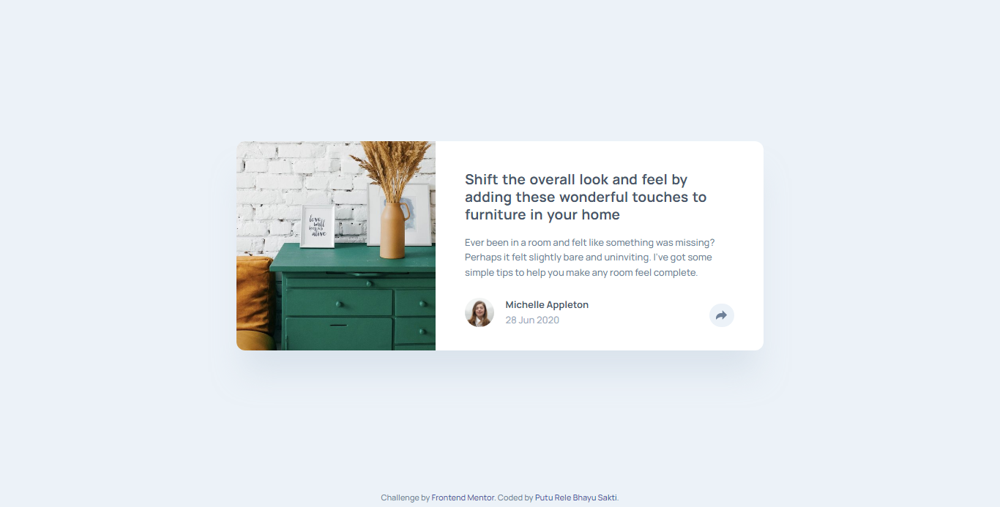
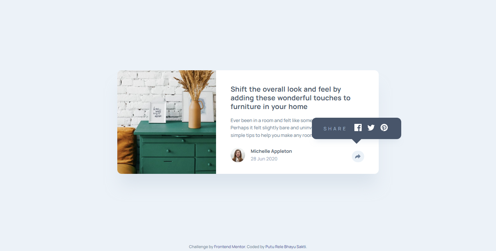
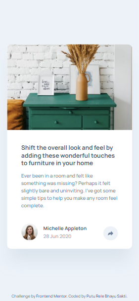
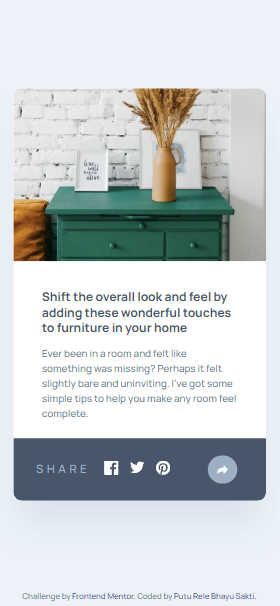

# Frontend Mentor - Article preview component solution

This is a solution to the [Article preview component challenge on Frontend Mentor](https://www.frontendmentor.io/challenges/article-preview-component-dYBN_pYFT). Frontend Mentor challenges help you improve your coding skills by building realistic projects.

## Table of contents

- [Overview](#overview)
  - [The challenge](#the-challenge)
  - [Screenshot](#screenshot)
  - [Links](#links)
- [My process](#my-process)
  - [Built with](#built-with)
  - [What I learned](#what-i-learned)
  - [Continued development](#continued-development)
  - [Useful resources](#useful-resources)
- [Author](#author)

## Overview

### The challenge

Users should be able to:

- View the optimal layout for the component depending on their device's screen size
- See the social media share links when they click the share icon

### Screenshot

### Links

- Solution URL: [Solution URL here](https://www.frontendmentor.io/solutions/article-preview-component-with-mobilefirstdesign-approach-4otNXAbvos)
- Live Site URL: [Live site URL here](https://lere22.github.io/article-preview-component/)

## My process

### Built with

- Semantic HTML5 markup
- CSS custom properties
- Flexbox
- CSS Grid
- Mobile-first workflow
- Javascript

### What I learned

What i learned from creating the project Article preview component is how to use grid especially with grid template areas and how to show/hide a popup share.

### Continued development

I want to continue this project to collaborate with my other projects in the future.

### Useful resources

- [Fonts](https://fonts.google.com/) - This helped me for choosing the font what i want.
- [Frontend Mentor Resource](https://www.frontendmentor.io/resources) - This is an amazing resource which helped me to working on frontend project.
- [W3 Schools](https://www.w3schools.com/) - This helped me for understanding the syntax of some programming language.
- [nekoCalc](https://nekocalc.com/) - This helped me to convert pixels(PX) to REM.

## Author

- Code by - Putu Rele Bhayu Sakti
- Frontend Mentor - [@lere22](https://www.frontendmentor.io/profile/lere22)
